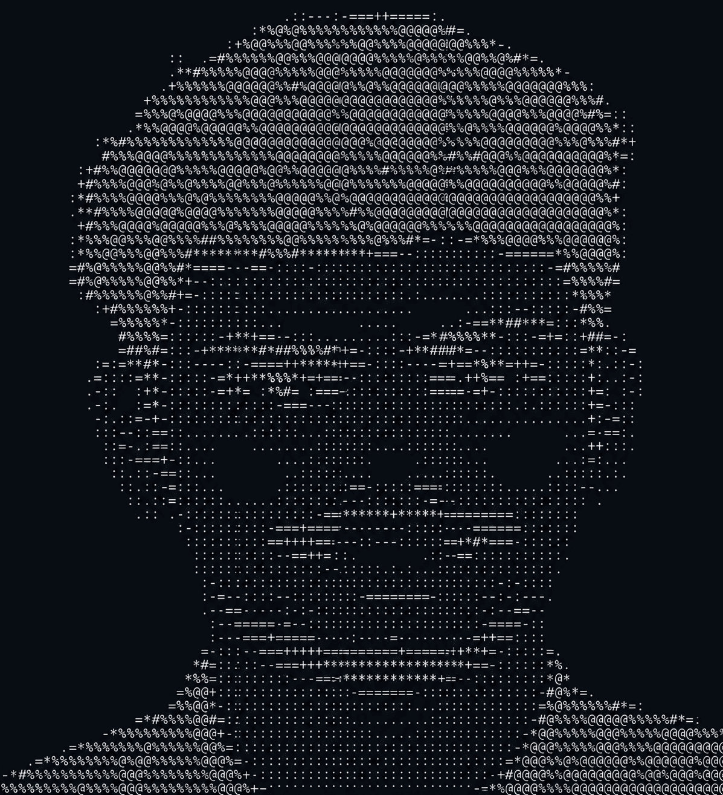
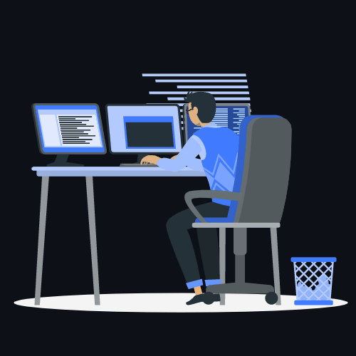
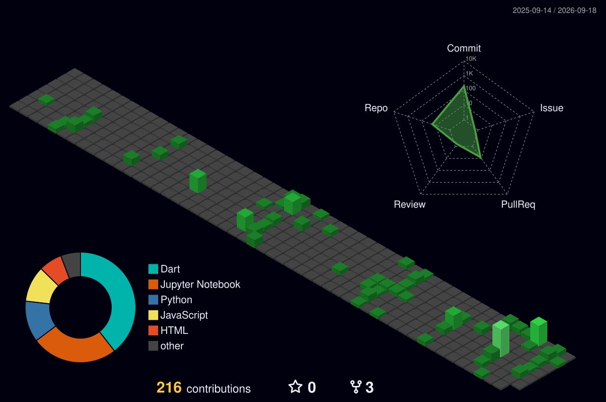

<h1 align="center">Hi, I'm Adarsh 👋</h1>

AI/ML engineer building RAG pipelines, multimodal LLM tools, and edge robotics — from vector search to welded steel.

  
  
  

---

### Currently

- 🎓 Final-year B.Tech (AI & Data Science) at Jyothi Engineering College — graduating March 2026
- 🧠 Building multi-agent RAG pipelines with LangGraph/LangChain, hybrid search (BM25 + vector RRF), and multimodal ingestion
- 🤖 Prototyping edge AI on Raspberry Pi 5 / ESP32 — computer vision, voice, and sensor-driven robotics
- 📄 Co-author on a 2025 IEEE paper introducing a Malayalam visual speech recognition dataset

---

### Tech Stack

  

**Languages & ML** — Python (PyTorch, TensorFlow, LangChain), C, Java
**Frontend** — Flutter, Flask
**Backend & Data** — MongoDB, Milvus, Firebase, MySQL
**Tools** — Docker, Git/GitHub, n8n, Model Context Protocol (MCP)
**Hardware** — Raspberry Pi 5, ESP32, welding & metal fabrication

---

<!--
  ASCII art portrait (dark/light mode responsive) + Coder GIF.
  Uses <picture> with prefers-color-scheme to swap white/black variants.
-->

  <a href="https://github.com/Adarsh-S1">
    <picture>
      <source media="(prefers-color-scheme: dark)" srcset="assets/ascii-art-white.png">
      <source media="(prefers-color-scheme: light)" srcset="assets/ascii-art-black.png">
      
    </picture>
  </a>
  &nbsp; &nbsp; &nbsp;
  

---

### Publications

- **MAL-VSR: A Dual-Stream Architecture and Dataset for Malayalam Visual Speech Recognition** — IEEE, 2025. A 4,850+ clip dataset enabling AI lip-reading for Malayalam.
- **Personal Companion Robot – Smart Buddy** — IEEE, 2025. YOLOv8 tracking + Gemini voice interaction on Raspberry Pi 5 (88.7% tracking accuracy, 82.4% intent recognition).

---

### Recognition

🏆 First Prize, Software Track — I.D.E.A 2025 Intercollege Ideathon (IEEE SB AJCE × IEEE YP Kerala)
🌏 Indo-Malaysian International Hackathon (DEKATHON 3.0) participant, SDG-focused 3-day residential hackathon

---

<!--
  Isometric 3D contribution calendar.
  Generated daily by the yoshi389111/github-profile-3d-contrib GitHub Action
  (see setup note below) and committed to profile-3d-contrib/ in this repo.
-->

  

  📫 Reach me at <a href="mailto:adarshs112004@gmail.com">adarshs112004@gmail.com</a>

